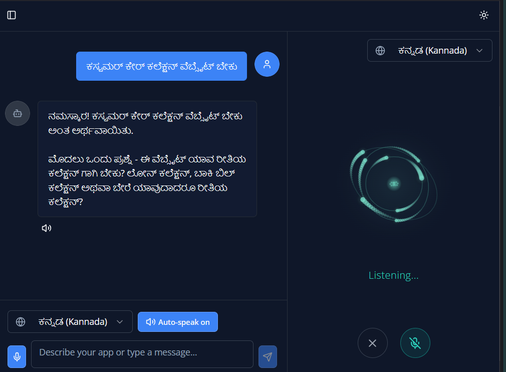
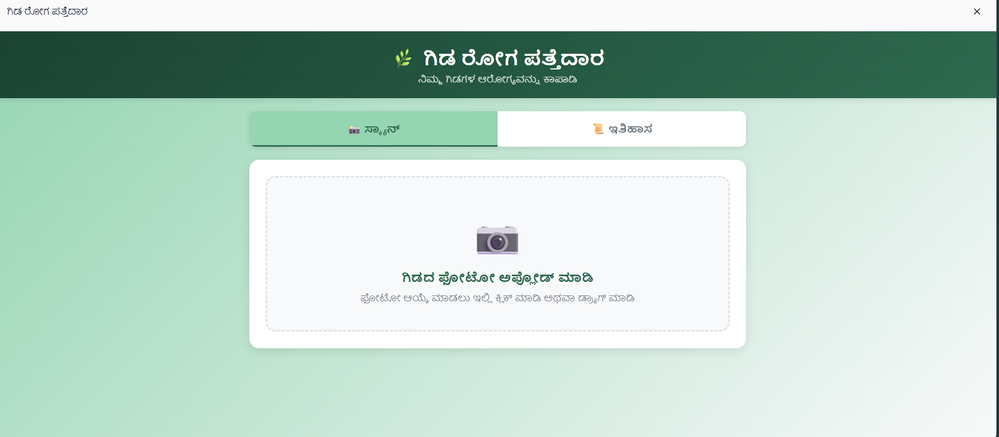

# 🇮🇳 Indic Copilot — Voice-Driven AI App Builder

> Build full web applications by **speaking** in any Indian language. Powered by Claude AI.

Indic Copilot lets anyone — regardless of coding ability — create complete web applications through natural voice conversations in **20+ languages** including Kannada, Hindi, Tamil, Telugu, Malayalam, Marathi, Bengali, Gujarati, Punjabi, Odia, and English.

Just describe what you want, answer a few clarifying questions, and Indic Copilot generates a production-ready HTML/CSS/JS app — complete with **database persistence** and **AI capabilities** (including vision).


---

## ✨ Key Features

- **🎙️ Multilingual Voice I/O** — Speak and listen in 20+ languages via Silero VAD + Web Speech API + Sarvam AI TTS
- **🤖 AI-Powered Planning** — Claude asks intelligent clarifying questions to fully understand your app requirements before building
- **⚡ Instant App Generation** — Generates complete, self-contained HTML/CSS/JS applications from conversation
- **💾 Built-in App Database (AppDB)** — Every generated app gets collection-based document storage backed by PostgreSQL
- **🧠 Built-in App AI (AppAI)** — Generated apps can call Claude for text Q&A and image/vision analysis
- **📱 Dashboard** — Manage, preview (fullscreen), and delete all your generated apps
- **🔗 App Sharing** — Share apps via unique links with WhatsApp integration
- **📋 Clone & Remix** — Clone any shared app into your own workspace
- **🔒 Authentication** — Email/password auth with user-scoped workspaces

---

## 🖼️ Screenshots

| Voice Chat (Kannada) | Generated App — Plant Disease Detector |
|---|---|
|  |  |

---

## 🏗️ Architecture

```
┌─────────────────────────────────────────────────────────┐
│                     Frontend (React)                     │
│  Vite · TypeScript · TanStack Query · Tailwind · shadcn │
│  Silero VAD (ONNX) · Web Speech API · Sarvam TTS        │
├─────────────────────────────────────────────────────────┤
│                    Backend (Express.js)                   │
│  Passport.js Auth · SSE Streaming · Claude AI SDK        │
│  App Serving · AppDB API · AppAI Proxy · TTS Proxy       │
├─────────────────────────────────────────────────────────┤
│                   PostgreSQL (Drizzle ORM)                │
│  Users · Conversations · Messages · Apps · AppStorage    │
└─────────────────────────────────────────────────────────┘
```

### Tech Stack

| Layer | Technology |
|---|---|
| **Frontend** | React 18, TypeScript, Vite, TanStack Query, Tailwind CSS, shadcn/ui, Framer Motion |
| **Backend** | Express.js 5, TypeScript, tsx |
| **Database** | PostgreSQL, Drizzle ORM |
| **Auth** | Passport.js (local strategy), express-session, connect-pg-simple |
| **AI** | Anthropic Claude SDK (planning + code generation + vision) |
| **Voice (VAD)** | Silero VAD v5 via ONNX Runtime Web (@ricky0123/vad-web) |
| **Voice (STT)** | Browser Web Speech API (SpeechRecognition) |
| **Voice (TTS)** | Sarvam AI (bulbul:v3, primary) → Browser SpeechSynthesis (fallback) |
| **Routing** | Wouter |

---

## 📂 Project Structure

```
Indic-Copilot/
├── client/
│   ├── public/                  # ONNX models, WASM, worklets for VAD
│   └── src/
│       ├── components/          # UI components (voice-overlay, particle-sphere, etc.)
│       ├── hooks/               # use-auth, use-voice, custom hooks
│       ├── lib/                 # Utilities
│       └── pages/
│           ├── auth.tsx         # Login / Register
│           ├── builder.tsx      # Main voice chat builder
│           ├── dashboard.tsx    # Generated apps gallery
│           └── shared-app.tsx   # Public shared app viewer
├── server/
│   ├── auth.ts                  # Passport.js setup (register, login, session)
│   ├── routes.ts                # All API endpoints
│   ├── storage.ts               # Database CRUD operations
│   ├── db.ts                    # Database connection
│   └── index.ts                 # Express server entrypoint
├── shared/
│   └── schema.ts                # Drizzle schema (users, conversations, messages, apps)
├── script/
│   └── build.ts                 # Production build script
├── drizzle.config.ts
├── package.json
├── tailwind.config.ts
├── tsconfig.json
└── vite.config.ts
```

---

## 🚀 Getting Started

### Prerequisites

- **Node.js** ≥ 18
- **PostgreSQL** database
- **Sarvam AI API key** (for Indian language TTS)

### Environment Variables

| Variable | Description |
|---|---|
| `DATABASE_URL` | PostgreSQL connection string |
| `SARVAM_API_KEY` | Sarvam AI API key for text-to-speech |
| `SESSION_SECRET` | Express session secret (optional, auto-generated if not set) |

### Installation

```bash
# Clone the repository
git clone https://github.com/<your-username>/Indic-Copilot.git
cd Indic-Copilot

# Install dependencies
npm install

# Push database schema
npm run db:push

# Start development server
npm run dev
```

The app will be available at **http://localhost:5000**.

### Production Build

```bash
npm run build
npm start
```

---

## 🔄 How It Works

1. **Choose a language** — Select from 20+ supported languages
2. **Start talking** — Describe the app you want to build
3. **Planning phase** — Claude asks clarifying questions to understand your requirements
4. **Approve the plan** — Say "yes", "approve", or "build it"
5. **App generation** — Claude generates a complete HTML/CSS/JS application (streamed via SSE)
6. **Use your app** — Preview it fullscreen, share it, or clone it

### Voice Sandwich Architecture

```
Mic Input → Silero VAD (speech detection) → Web Speech API (STT)
    → Claude AI (planning/generation)
        → Sarvam AI TTS (spoken response) → Resume listening
```

---

## 📡 API Reference

### Auth (Public)
| Method | Endpoint | Description |
|---|---|---|
| `POST` | `/api/register` | Create account (email, password, name) |
| `POST` | `/api/login` | Sign in |
| `POST` | `/api/logout` | Sign out |
| `GET` | `/api/user` | Get current user |

### Protected (Require Auth)
| Method | Endpoint | Description |
|---|---|---|
| `GET/POST/DELETE` | `/api/conversations` | Conversation CRUD (user-scoped) |
| `GET` | `/api/conversations/:id` | Get conversation with messages |
| `POST` | `/api/conversations/:id/messages` | Send message (SSE streaming) |
| `GET/DELETE` | `/api/apps` | Generated apps CRUD (user-scoped) |
| `GET` | `/api/apps/:id/serve` | Serve app HTML with injected helpers |
| `POST` | `/api/apps/:id/share` | Generate share link |
| `DELETE` | `/api/apps/:id/share` | Disable sharing |

### Public
| Method | Endpoint | Description |
|---|---|---|
| `GET` | `/api/shared/:shareId` | Get shared app metadata |
| `GET` | `/api/shared/:shareId/serve` | Serve shared app HTML |
| `POST` | `/api/shared/:shareId/clone` | Clone shared app (requires auth) |
| `*` | `/api/app-storage/:appId/:collection[/:docId]` | Document storage for generated apps |
| `POST` | `/api/app-ai/chat` | AI proxy for generated apps (text + vision) |
| `POST` | `/api/tts` | TTS via Sarvam AI (returns WAV audio) |

---

## 🧩 Generated App Helpers

Every generated app is automatically injected with two powerful APIs:

### AppDB — Document Storage
```javascript
await AppDB.list("todos");              // List all docs in collection
await AppDB.get("todos", "doc-id");     // Get a document
await AppDB.create("todos", { ... });   // Create a document
await AppDB.update("todos", "id", {}); // Update a document
await AppDB.remove("todos", "doc-id");  // Delete a document
await AppDB.clear("todos");            // Clear a collection
```

### AppAI — AI Capabilities
```javascript
await AppAI.ask("What is photosynthesis?");           // Text Q&A
await AppAI.ask("Describe this image", imageFile);    // Vision analysis
await AppAI.analyzeImage(file, "Detect plant disease"); // Image analysis
await AppAI.chat({ messages: [...], system: "..." }); // Full chat
```

---

## 🌍 Supported Languages

Kannada · Hindi · Tamil · Telugu · Malayalam · Marathi · Bengali · Gujarati · Punjabi · Odia · English (India) — and 10+ more via Web Speech API.

**Sarvam TTS** supports: `kn`, `hi`, `ta`, `te`, `ml`, `mr`, `bn`, `gu`, `pa`, `od`, `en-IN`

---

## 📄 License

MIT

---

<p align="center">
  Built with ❤️ for <strong>Build India Hackathon</strong>
</p>
